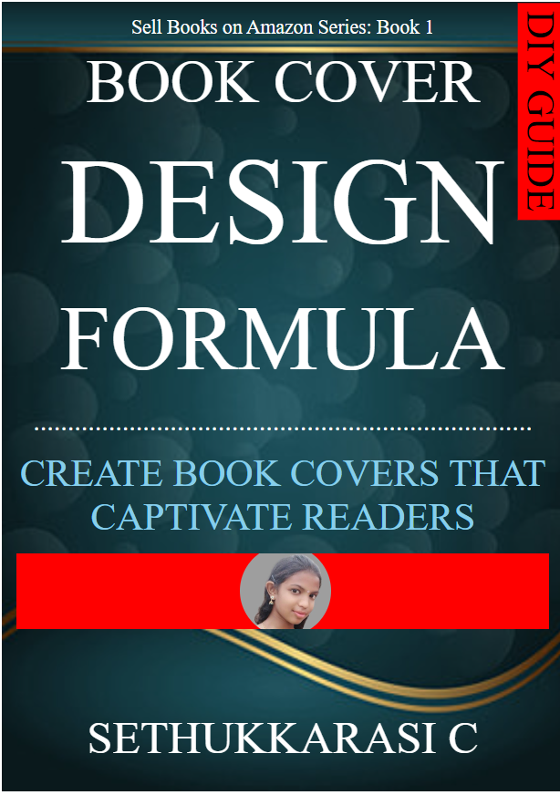

# Ex.06 Book Front Cover Page Design
## Date:26.04.2024

## AIM:
To design a book front cover page using HTML and CSS.

## DESIGN STEPS:

### Step 1:
Create a Django Admin project.

### Step 2:
Create an app in the Django interface.

### Step 3:
Create a folder named 'static' in the app folder.

### Step 4:
Create a new HTML file in the static folder.

### Step 5:
Write the HTML code with relevant CSS properties.

### Step 6:
Choose the appropriate style and color scheme.

### Step 7:
Insert the images in their appropriate places.

### Step 8:
Publish the website in the LocalHost.

## PROGRAM:
```
<!DOCTYPE html>
<html lang="en">

<head>
  <meta charset="UTF-8">
  <meta name="viewport" content="width=device-width, initial-scale=1.0">
  <title>BOOK COVER</title>
  <link rel="stylesheet" href="https://cdn.jsdelivr.net/npm/bootstrap-icons@1.11.3/font/bootstrap-icons.min.css">
  <style>
    .rotated-text {
      transform: rotate(90deg);
      /* Rotate the text 30 degrees counterclockwise */
      transform-origin: right top;
      /* Set the rotation origin to the top-right corner */
      text-wrap: balance;
      position: absolute;
      /* Position the text absolutely */
      top: 27%;
      /* Distance from the top of the page */
      right: 34%;
      /* Distance from the right of the page */
      font-size: 52px;
      /* Set the font size */
      color: black;
      /* Set the text color */
      background-color: red;
      padding-right: 10px;
      padding-left: 10px;
    }

    .background {
      width: 700px;
      height: 1000px;
      color: white;
      margin-left: auto;
      margin-right: auto;
      padding: 20px;
      font-family: ' Arial, sans-serif';
      background-image: url(back.png);
      background-size: cover;
    }

    .first {
      font-size: 26px;
      padding-bottom: 10px;
    }

    .second {
      font-size: 80px;
    }

    .third {
      font-size: 160px;
    }

    .fourth {
      font-size: 120px;
    }

    .fifth {
      font-size: 36px;
    }

    .sixth {
      font-size: 50px;
      color: skyblue;
    }

    hr {
      border: none;
      height: 2px;
      background-color: red;
      width: 100%;
    }

    .ninth {
      font-size: 60px;
      padding-top: 108px;
    }

    .ruler {
    width: 100%;
    height: 100px;
    background-color: #f00;
    position: relative;
    overflow: hidden;
  }
  .circle {
    width: 120px; /* Diameter of the circle */
    height: 120px; /* Diameter of the circle */
    background-color: #f00; /* Circle background color */
    border-radius: 50%; /* Make it a circle */
    position: absolute;
    left: 42%;
    transform: translateX(-50%);
    top: 50%;
    transform: translateY(-50%);
    display: flex;
    justify-content: center;
    align-items: center;
    overflow: hidden;
  }
  .circle img {
    max-width: 100%;
    max-height: 100%;
    border-radius: 50%; /* Ensure the image is also in a circle */
  }

  </style>
</head>

<body>
  <div class="background">
    <div class="rotated-text">DIY GUIDE</div>
    <center>
      <div class="first">Sell Books on Amazon Series: Book 1<br></div>
      <div class="second">BOOK COVER</div><br>
      <div class="third">DESIGN</div><br>
      <div class="fourth">FORMULA</div><br>
      <div class="fifth">.........................................................................</div><br>
      <div class="sixth">CREATE BOOK COVERS THAT <br>CAPTIVATE READERS</div><br>
      <div class="ruler">
        <div class="circle">
          
        </div>
      </div>
      <div class="ninth">SETHUKKARASI C</div>
    </center>
  </div>
</body>

</html>
```

## OUTPUT:


## RESULT:
The program for designing book front cover page using HTML and CSS is completed successfully.
